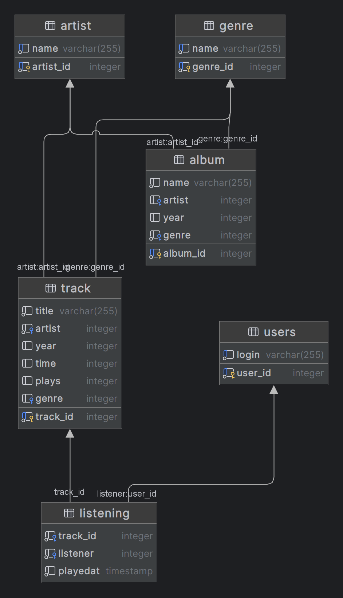

# Домашняя работа №2

## Задание 1
Напишите запросы для создания таблицы, cпроектированной в Домашнем задании №1 Базы данных для сервиса прослушивания музыки, в которой будет храниться информация о музыкальных треках (исполнитель, год, время, количество прослушиваний, жанр), об исполнителях, альбомах (исполнитель, год выпуска, жанр).

Добавьте связи между таблицами. Выполните запросы на учебной схеме БД.

Добавьте в отчет результаты выполнения запросов (например, скрин схемы БД).

``` sql
create table student15.artist
(
    artist_id serial primary key,
    name      varchar(255) not null unique
);
alter table student15.artist owner to student15;

create table student15.genre
(
    genre_id serial
        primary key,
    name     varchar(255) not null unique
);
alter table student15.genre owner to student15;

create table student15.track
(
    track_id serial primary key,
    title    varchar(255) not null,
    artist   integer      not null
        references student15.artist,
    year     integer,
    time     integer,
    plays    integer default 0,
    genre    integer      references student15.genre
);
alter table student15.track owner to student15;

create table student15.album
(
    album_id serial primary key,
    name     varchar(255) not null,
    artist   integer
        references student15.artist,
    year     integer,
    genre    integer      not null references student15.genre
);
alter table student15.album owner to student15;

create table student15.users
(
    user_id serial
        primary key,
    login   varchar(255) not null
        unique
);
alter table student15.users owner to student15;

create table student15.listening
(
    track_id integer   not null references student15.track,
    listener integer   not null
        references student15.users,
    playedat timestamp not null
);
alter table student15.listening owner to student15;
```



## Задание 2
Напишите запросы для наполнения БД (3 трека (можно больше), 2-3 исполнителя/группы, 1 альбом. Выполните запросы на учебной схеме БД.

Добавьте в отчет результат выполнения запросов – скрины заполненных таблиц.

``` sql
--- см. папку task2
```

## Задание 3
Составьте запрос для поиска исполнителей, у которых есть треки в жанре “N” (например, рок).

Добавьте в отчет результат выполнения запроса.

``` sql
SELECT DISTINCT A.name
FROM artist A
         JOIN track T ON A.artist_id = T.artist
         JOIN genre G ON T.genre = G.genre_id
WHERE G.name = 'Rock';
```

### Результат:

| name |
| :--- |
| Led Zeppelin |
| Queen |
| The Beatles |


## Задание 4
Составьте запрос для поиска исполнителей, у которых нет ни одного трека в жанре “M” (например, кантри).

Добавьте в отчет результат выполнения запроса.

``` sql
SELECT DISTINCT A.name
FROM artist A
WHERE A.artist_id NOT IN (SELECT DISTINCT T.artist
                          FROM track T
                                   JOIN genre G ON T.genre = G.genre_id
                          WHERE G.name = 'Rock');
```

### Результат:

| name |
| :--- |
| Adele |
| Michael Jackson |


## Задание 5
Составьте запрос для поиска треков в жанре “Х” (например, поп) с числом прослушиваний, более 30000.

Добавьте в отчет результат выполнения запроса.

``` sql
SELECT T.title
FROM track T
         JOIN genre G ON T.genre = G.genre_id
WHERE G.name = 'Rock'
  AND T.plays > 4000;
```

### Результат:

| title |
| :--- |
| Yesterday |
| Whole Lotta Love |
| We Will Rock You |


## Задание 6
Составьте запрос для поиска исполнителей жанра Y (например, рэп), у которых среднее число прослушиваний треков более 20 000 000.

Добавьте в отчет результат выполнения запроса.

``` sql
SELECT DISTINCT A.name
FROM artist A
         JOIN track T ON A.artist_id = T.artist
         JOIN genre G ON T.genre = G.genre_id
WHERE G.name = 'Rock'
GROUP BY A.artist_id, A.name
HAVING AVG(T.plays) > 2500;
```
### Результат:

| name |
| :--- |
| Led Zeppelin |
| Queen |


## Задание 7
Составьте запрос для определения суммы прослушиваний песен в жанре “M”.

Добавьте результаты выполнения в отчет.

``` sql
SELECT SUM(T.plays)
FROM track T
         JOIN genre G ON T.genre = G.genre_id
WHERE G.name = 'Rock';
```

### Результат:

| sum |
| :--- |
| 31000 |


## Задание 8
Составьте запрос для определения суммы прослушиваний по жанрам, отсортированным по возрастанию количества прослушиваний.

``` sql
SELECT G.name, SUM(T.plays) AS total_plays
FROM track T
         JOIN genre G ON T.genre = G.genre_id
GROUP BY G.genre_id, G.name
ORDER BY total_plays ASC;
```

### Результат:

| name | total\_plays |
| :--- | :--- |
| Pop | 24000 |
| Rock | 31000 |


## Задание 9
Составьте запрос определения среднего числа прослушиваний у исполнителей, отсортированных по убыванию количества прослушиваний.

Добавьте результаты выполнения в отчет.

``` sql
SELECT A.name, AVG(T.plays) AS avg_plays
FROM artist A
         JOIN track T ON A.artist_id = T.artist
GROUP BY A.artist_id, A.name
ORDER BY avg_plays DESC;
```

### Результат:

| name | avg\_plays |
| :--- | :--- |
| Adele | 7500 |
| Queen | 6500 |
| Led Zeppelin | 5500 |
| Michael Jackson | 4500 |
| The Beatles | 1750 |


## Задание 10
Составьте запрос для определения суммы числа прослушиваний по исполнителям, отсортированным по возрастанию числа прослушиваний.

Добавьте результаты выполнения в отчет.

``` sql
SELECT A.name, SUM(T.plays) AS total_plays
FROM artist A
         JOIN track T ON A.artist_id = T.artist
GROUP BY A.artist_id, A.name
ORDER BY total_plays ASC;
```

### Результат:

| name | total\_plays |
| :--- | :--- |
| The Beatles | 7000 |
| Michael Jackson | 9000 |
| Led Zeppelin | 11000 |
| Queen | 13000 |
| Adele | 15000 |

## Задание 11
Составьте запрос для определения количества песен у каждого исполнителя.

Добавьте результаты выполнения в отчет.

``` sql
SELECT A.name, COUNT(T.track_id) AS num_tracks
FROM artist A
         JOIN track T ON A.artist_id = T.artist
GROUP BY A.artist_id, A.name;
```

### Результат:

| name | num\_tracks |
| :--- | :--- |
| Led Zeppelin | 2 |
| Adele | 2 |
| Queen | 2 |
| Michael Jackson | 2 |
| The Beatles | 4 |


## Задание 12
Добавьте в список жанров несколько новых жанров.

``` sql
INSERT INTO genre (name) VALUES ('Rock'), ('Pop');
```

Напишите JOIN запросы для таблиц исполнители и песни: INNER JOIN, LEFT OUTER JOIN, RIGHT OUTER JOIN, FULL JOIN.

Добавьте результаты выполнения в отчет.

``` sql
-- INNER JOIN:

SELECT A.name, T.title
FROM artist A
         INNER JOIN track T ON A.artist_id = T.artist;
```

### Результат:

| name | title |
| :--- | :--- |
| The Beatles | Hey Jude |
| Michael Jackson | Billie Jean |
| Led Zeppelin | Stairway to Heaven |
| Queen | Bohemian Rhapsody |
| Adele | Someone Like You |
| The Beatles | Yesterday |
| Michael Jackson | Beat It |
| Led Zeppelin | Whole Lotta Love |
| Queen | We Will Rock You |
| Adele | Rolling in the Deep |


``` sql
-- LEFT OUTER JOIN:

SELECT A.name, T.title
FROM artist A
         LEFT OUTER JOIN track T ON A.artist_id = T.artist;
```

### Результат:

| name | title |
| :--- | :--- |
| The Beatles | Hey Jude |
| Michael Jackson | Billie Jean |
| Led Zeppelin | Stairway to Heaven |
| Queen | Bohemian Rhapsody |
| Adele | Someone Like You |
| The Beatles | Yesterday |
| Michael Jackson | Beat It |
| Led Zeppelin | Whole Lotta Love |
| Queen | We Will Rock You |
| Adele | Rolling in the Deep |


``` sql
-- RIGHT OUTER JOIN:

SELECT A.name, T.title
FROM artist A
         RIGHT OUTER JOIN track T ON A.artist_id = T.artist;
```

### Результат:

| name | title |
| :--- | :--- |
| The Beatles | Hey Jude |
| Michael Jackson | Billie Jean |
| Led Zeppelin | Stairway to Heaven |
| Queen | Bohemian Rhapsody |
| Adele | Someone Like You |
| The Beatles | Yesterday |
| Michael Jackson | Beat It |
| Led Zeppelin | Whole Lotta Love |
| Queen | We Will Rock You |
| Adele | Rolling in the Deep |

``` sql
-- FULL JOIN:

SELECT A.name, T.title
FROM artist A
         FULL OUTER JOIN track T ON A.artist_id = T.artist;
```

### Результат:

| name | title |
| :--- | :--- |
| The Beatles | Hey Jude |
| Michael Jackson | Billie Jean |
| Led Zeppelin | Stairway to Heaven |
| Queen | Bohemian Rhapsody |
| Adele | Someone Like You |
| The Beatles | Yesterday |
| Michael Jackson | Beat It |
| Led Zeppelin | Whole Lotta Love |
| Queen | We Will Rock You |
| Adele | Rolling in the Deep |


## Задание 13
Добавьте в список песню какого-либо исполнителя, заполнив ее жанр значением NULL.

Напишите запрос по выводу списка жанров, для которых нет песен в таблице (с учетом особенностей сравнения с NULL).

Добавьте результаты выполнения в отчет.

``` sql
INSERT INTO track (title, artist, year, time, plays, genre)
VALUES ('Новая песня', 1, 2023, 240, 0, NULL);

SELECT G.name
FROM genre G
         LEFT JOIN track T ON G.genre_id = T.genre
WHERE T.track_id IS NULL;
```

### Результат:

| name |
| :--- |
| Hip-Hop |
