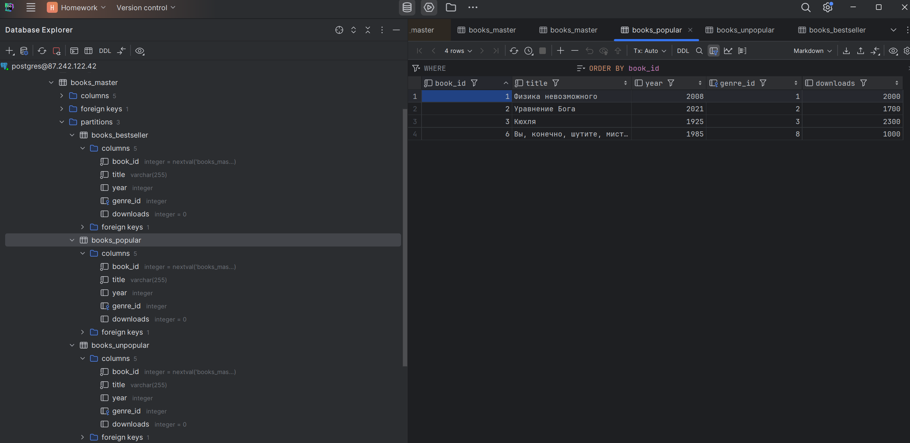
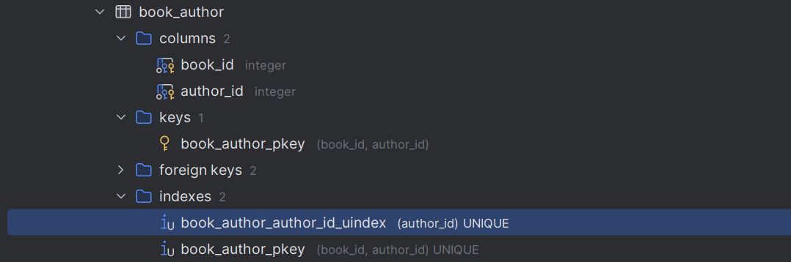

## Задание 1
Напишите запросы для создания таблицы, cпроектированной в Домашнем задании №1 Базы данных электронных книг, добавьте связи между таблицами. Выполните запросы на учебной схеме БД.

## Задание 2
Для таблицы со список книг добавьте разделы партиционирования методом Range по количеству скачиваний:

* P1: число скачиваний меньше 1000;
* P2: число скачиваний больше или равно 1000 и меньше 10000;
* P3: число скачиваний больше или равно 10000.
Добавьте в отчет результаты выполнения запросов (например, скрин схемы БД).



## Задание 3
Напишите запросы для наполнения БД. Выполните запросы на учебной схеме БД.

Добавьте в отчет результат выполнения запросов – скрины заполненных таблиц, результаты вызова к партициям.

| Название                               | Автор                      | Год  | Страниц | Жанр                | Скачиваний  |
|----------------------------------------|----------------------------|------|---------|---------------------|-------------|
| Физика невозможного                    | Митио Каку                 | 2008 | 460     | Non-fiction         | 2000        |
| Эгоистичный ген                        | Ричард Докинз              | 1989 | 610     | Non-fiction         | 400         |
| Вы, конечно, шутите, мистер Фейнман!   | Ричард Фейнман             | 1985 | 450     | Non-fiction         | 1000        |
| Кюхля                                  | Юрий Тынянов               | 1925 | 350     | Исторический роман  | 2300        |
| За миллиард лет до конца света         | Аркадий и Борис Стругацкие | 1977 | 150     | Фантастика          | 20000       |
| Понедельник начинается в субботу       | Аркадий и Борис Стругацкие | 1964 | 250     | Фантастика          | 21000       |
| Уравнение Бога. В поисках теории всего | Митио Каку                 | 2021 | 200     | Non-fiction         | 1700        |

``` sql
create table student15.book
(
    book_id   serial
        primary key,
    title     varchar(255) not null,
    year      integer,
    genre_id  integer
        references student15.genre,
    downloads integer default 0
);

alter table student15.book
    owner to student15;
```

| book\_id | title | year | genre\_id | downloads |
| :--- | :--- | :--- | :--- | :--- |
| 7 | The Lord of the Rings | 1954 | 8 | 5000 |
| 2 | The Catcher in the Rye | 1951 | 2 | 12000 |
| 5 | To Kill a Mockingbird | 1960 | 2 | 18000 |
| 3 | 1984 | 1949 | 3 | 1000 |
| 1 | The Iliad | -800 | 1 | 500 |
| 8 | Anna Karenina | 1877 | 5 | 8000 |
| 6 | The Great Gatsby | 1925 | 2 | 250 |
| 4 | Pride and Prejudice | 1813 | 4 | 3500 |
| 10 | Доктор Живаго | 1955 | 3 | 20300 |


Напишите запрос для получения списка rowid записей в таблицах с книгами, авторами и жанрами.

``` sql
select CTID, book_id from books_master;
```

| ctid | book\_id |
| :--- | :--- |
| \(0,4\) | 5 |
| \(0,6\) | 1 |
| \(0,8\) | 2 |
| \(0,9\) | 3 |
| \(0,10\) | 6 |
| \(0,4\) | 4 |
| \(0,5\) | 7 |

Проведите анализ значений rowid, приложите информацию в отчет.

ctid - служебный идентификатор, который "уникальный" в рамках таблицы (не таблиц), несёт в себе больше идею версионирования строк, чем являться привычным первичным ключём. Активно используется самой базой данных и поэтому использовать его как id не самая лучшая идея (см. подробнее
[Confirming The Characteristics Of CTID the Column](https://dev.to/ngfizzy/postgresql-pseudocolumns-ctid-108a)).

Напишите запросы, чтобы проверить, какие книги находятся в партициях p1, p2, p3.

``` sql
select CTID, book_id from books_unpopular;
```

| ctid | book\_id | title | year | genre\_id | downloads |
| :--- | :--- | :--- | :--- | :--- | :--- |
| \(0,4\) | 5 | Эгоистичный ген | 1989 | 2 | 400 |

``` sql
select CTID, book_id from books_popular;
```

| ctid | book\_id | title | year | genre\_id | downloads |
| :--- | :--- | :--- | :--- | :--- | :--- |
| \(0,6\) | 1 | Физика невозможного | 2008 | 1 | 2000 |
| \(0,8\) | 2 | Уравнение Бога | 2021 | 2 | 1700 |
| \(0,9\) | 3 | Кюхля | 1925 | 3 | 2300 |
| \(0,10\) | 6 | Вы, конечно, шутите, мистер Фейнман! | 1985 | 8 | 1000 |

``` sql
select CTID, book_id from books_bestseller;
```

| ctid | book\_id | title | year | genre\_id | downloads |
| :--- | :--- | :--- | :--- | :--- | :--- |
| \(0,4\) | 4 | Понедельник начинается в субботу | 1964 | 4 | 21000 |
| \(0,5\) | 7 | За миллиард лет до конца света | 1977 | 5 | 20000 |

## Задание 4
Составьте индекс по автору книги.

``` sql
create unique index book_author_author_id_uindex
    on book_author (author_id);
```



## Задание 5
Составьте запрос для определения суммы скачиваний книг в жанре «исторический роман».

``` sql
SELECT SUM(B.downloads)
FROM book B
         JOIN genre G ON B.genre_id = G.genre_id
WHERE G.name = 'Romance';
```

Результат:

3500

## Задание 6
Составьте запрос для определения суммы скачиваний по жанрам.

``` sql
SELECT G.name, SUM(B.downloads) AS total_downloads
FROM book B
         JOIN genre G ON B.genre_id = G.genre_id
GROUP BY G.genre_id, G.name
ORDER BY total_downloads DESC;
```

| name | total\_downloads |
| :--- | :--- |
| Fiction | 30250 |
| Historical Fiction | 8000 |
| Fantasy | 5000 |
| Romance | 3500 |
| Dystopian | 1000 |
| Epic Poetry | 500 |


## Задание 7
Составьте запрос определения среднего числа скачиваний у авторов.

``` sql
SELECT A.name, AVG(B.downloads) AS avg_downloads
FROM author A
         JOIN book_author BA ON A.author_id = BA.author_id
         JOIN book B ON BA.book_id = B.book_id
GROUP BY A.author_id, A.name
ORDER BY avg_downloads DESC;
```

| name | avg\_downloads |
| :--- | :--- |
| Harper Lee | 18000 |
| J.D. Salinger | 12000 |
| Leo Tolstoy | 8000 |
| J.R.R. Tolkien | 5000 |
| Jane Austen | 3500 |
| George Orwell | 1000 |
| Homer | 500 |
| F. Scott Fitzgerald | 250 |

## Задание 8
Составьте запрос для определения суммы числа скачиваний по авторам.

``` sql
SELECT A.name, SUM(B.downloads) AS total_downloads
FROM author A
         JOIN book_author BA ON A.author_id = BA.author_id
         JOIN book B ON BA.book_id = B.book_id
GROUP BY A.author_id, A.name
ORDER BY total_downloads DESC;
```

| name | total\_downloads |
| :--- | :--- |
| Harper Lee | 18000 |
| J.D. Salinger | 12000 |
| Leo Tolstoy | 8000 |
| J.R.R. Tolkien | 5000 |
| Jane Austen | 3500 |
| George Orwell | 1000 |
| Homer | 500 |
| F. Scott Fitzgerald | 250 |


## Задание 9
Составьте запрос для определения количества книг у каждого автора.

``` sql
SELECT A.name, COUNT(DISTINCT B.book_id) AS num_books
FROM author A
         JOIN book_author BA ON A.author_id = BA.author_id
         JOIN book B ON BA.book_id = B.book_id
GROUP BY A.author_id, A.name;
```

| name | num\_books |
| :--- | :--- |
| Homer | 1 |
| J.D. Salinger | 1 |
| George Orwell | 1 |
| Jane Austen | 1 |
| Harper Lee | 1 |
| F. Scott Fitzgerald | 1 |
| J.R.R. Tolkien | 1 |
| Leo Tolstoy | 1 |

## Задание 10
Добавьте в список жанров несколько новых жанров: детектив, фэнтези, биография.

``` sql
INSERT INTO genre (name) VALUES ('Детектив'), ('Фэнтези'), ('Биография');
```

Напишите JOIN запросы для таблиц жанры и книги: INNER JOIN, LEFT OUTER JOIN, RIGHT OUTER JOIN, FULL JOIN.

INNER JOIN:

``` sql
SELECT G.name, B.title
FROM genre G
INNER JOIN book B ON G.genre_id = B.genre_id;
```

| name | title |
| :--- | :--- |
| Epic Poetry | The Iliad |
| Fiction | The Great Gatsby |
| Fiction | To Kill a Mockingbird |
| Fiction | The Catcher in the Rye |
| Dystopian | 1984 |
| Romance | Pride and Prejudice |
| Historical Fiction | Anna Karenina |
| Fantasy | The Lord of the Rings |

LEFT OUTER JOIN:

``` sql
SELECT G.name, B.title
FROM genre G
LEFT OUTER JOIN book B ON G.genre_id = B.genre_id;
```

| name | title |
| :--- | :--- |
| Epic Poetry | The Iliad |
| Fiction | The Great Gatsby |
| Fiction | To Kill a Mockingbird |
| Fiction | The Catcher in the Rye |
| Dystopian | 1984 |
| Romance | Pride and Prejudice |
| Historical Fiction | Anna Karenina |
| Modernist Literature | null |
| Magic Realism | null |
| Fantasy | The Lord of the Rings |
| Science Fiction | null |
| Young Adult Fiction | null |
| Crime Fiction | null |
| Детектив | null |
| Фэнтези | null |
| Биография | null |

RIGHT OUTER JOIN:

``` sql
SELECT G.name, B.title
FROM genre G
RIGHT OUTER JOIN book B ON G.genre_id = B.genre_id;
```

| name | title |
| :--- | :--- |
| Epic Poetry | The Iliad |
| Fiction | The Great Gatsby |
| Fiction | To Kill a Mockingbird |
| Fiction | The Catcher in the Rye |
| Dystopian | 1984 |
| Romance | Pride and Prejudice |
| Historical Fiction | Anna Karenina |
| Fantasy | The Lord of the Rings |

FULL JOIN:

``` sql
SELECT G.name, B.title
FROM genre G
FULL OUTER JOIN book B ON G.genre_id = B.genre_id;
```

| name | title |
| :--- | :--- |
| Epic Poetry | The Iliad |
| Fiction | The Great Gatsby |
| Fiction | To Kill a Mockingbird |
| Fiction | The Catcher in the Rye |
| Dystopian | 1984 |
| Romance | Pride and Prejudice |
| Historical Fiction | Anna Karenina |
| Modernist Literature | null |
| Magic Realism | null |
| Fantasy | The Lord of the Rings |
| Science Fiction | null |
| Young Adult Fiction | null |
| Crime Fiction | null |
| Детектив | null |
| Фэнтези | null |
| Биография | null |

## Задание 11
Добавьте в список книгу:

Доктор Живаго Борис Пастернак 1955 660 NULL 20300

Напишите запрос по выводу списка жанров книг, для которых нет книг в таблице (с учетом особенностей сравнения с NULL).

``` sql
INSERT INTO book (title, year, genre_id, downloads) VALUES ('Доктор Живаго', 1955, 3, 20300);

SELECT G.name
FROM genre G
         LEFT JOIN book B ON G.genre_id = B.genre_id
WHERE B.book_id IS NULL;
```

| name |
| :--- |
| Modernist Literature |
| Magic Realism |
| Science Fiction |
| Young Adult Fiction |
| Crime Fiction |
| Детектив |
| Фэнтези |
| Биография |

* LEFT JOIN объединяет таблицы genre и book, беря все записи из genre и соответствующие записи из book.
* WHERE B.book_id IS NULL фильтрует результат, оставляя только те записи из genre, для которых в book нет соответствующих записей (то есть, для которых book_id  равен NULL).
*  Это необходимо, потому что для книг, у которых жанр не определен, поле genre_id  в таблице book  будет равно NULL.
